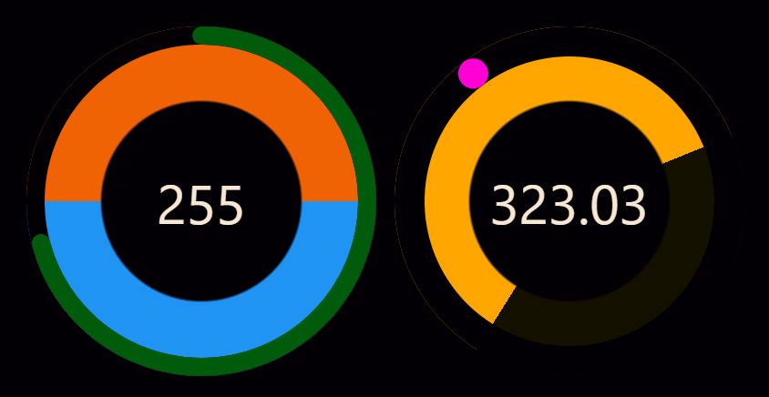

# SpaceTime Clock

This is a SvelteKit app that displays the current date and time in a unique way.
Created during the 2024 Solar Hackathon event in
[*Space](https://starspace.group).



## The Idea

Spacetime Clock aims to provide a new way to think of date and time that works
on any planet in a solar system. The date and time are represented as decimal
numbers between 0-359. The 0 day represents the summer soltice and the 0 time
represents solar noon.

## Why?

The idea for this clock was created by with the hopes that Earth may eventually
operate without timezones. In such a case it would be helpful (at the very least
conversationally) to have a way to express the current position of the sun
relative to your current position on Earth (or whichever planet you are on).

## Developing

Once you've cloned the repository and installed dependencies with `npm install`
(or `pnpm install` or `yarn`), start a development server:

```bash
npm run dev

# or start the server and open the app in a new browser tab
npm run dev -- --open
```
